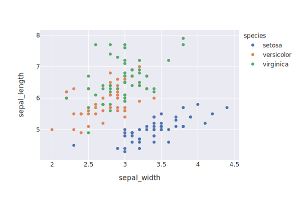
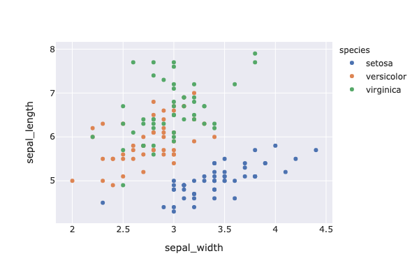

### Simple instructions
You can include a plotly HTML figure with the `include_relative` macro. Here are a few things to take note of:

* This allows you to include things that are not necessarily in the `_includes` subdirectory.
* The relative path must be in relation to this file, thus in the relevant subdirectory of the `_posts` directory in this case. You cannot use `../`.


#### Simple example


Notice that the length is constrained by whatever was set in Plotly.

#### For PNG and SVG
Use the classic Markdown syntax.

```

```





Note that PDF does not work.

### External reading
Read more [here](https://jekyllrb.com/docs/includes/).


```py
print("Thank you for reading.")
```

